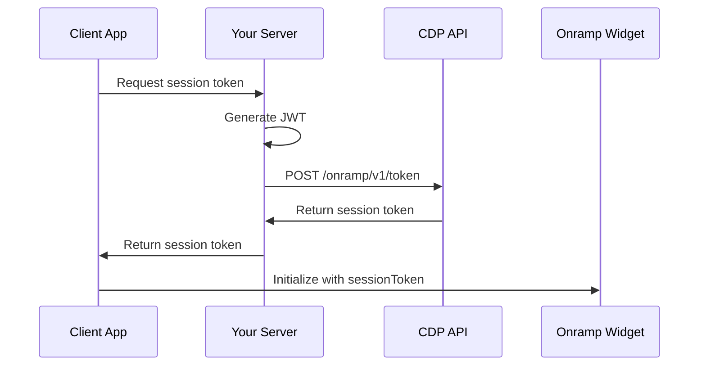

# CDP Onramp Session Tokens

Session tokens are required for all CDP Onramp integrations starting **July 31, 2025**. They provide secure authentication and session management for the onramp widget.

## Overview

Session tokens are single-use, short-lived tokens that:
- Expire after **5 minutes**
- Can only be used once to initialize the onramp widget
- Must be generated server-side using your CDP API credentials
- Replace the previous client-side authentication method

## Authentication Flow



## Implementation

### 1. Generate JWT

Create a JSON Web Token using your CDP API credentials:

```typescript
import { SignJWT } from 'jose'
import crypto from 'crypto'

export async function generateJWT(): Promise<string> {
  const privateKey = crypto.createPrivateKey({
    key: process.env.CDP_API_KEY_PRIVATE_KEY!,
    format: 'pem'
  })

  const jwt = await new SignJWT({})
    .setProtectedHeader({ 
      alg: 'ES256',                           // Required algorithm
      kid: process.env.CDP_API_KEY_NAME!,     // Your API key name
      typ: 'JWT'
    })
    .setIssuedAt()
    .setExpirationTime('5m')                  // CDP requirement
    .sign(privateKey)

  return jwt
}
```

### 2. Create Session Token

Use the JWT to request a session token from CDP:

```typescript
export async function createSessionToken(
  jwt: string,
  params: {
    addresses: Array<{
      address: string
      blockchains: string[]
    }>
    assets?: string[]
  }
): Promise<string> {
  const response = await fetch('https://api.developer.coinbase.com/onramp/v1/token', {
    method: 'POST',
    headers: {
      'Authorization': `Bearer ${jwt}`,
      'Content-Type': 'application/json'
    },
    body: JSON.stringify(params)
  })

  if (!response.ok) {
    throw new Error(`Failed to create session token: ${await response.text()}`)
  }

  const data = await response.json()
  return data.token || data.data?.token
}
```

### 3. API Route Implementation

Create a Next.js API route to generate session tokens:

```typescript
// app/api/onramp/session/route.ts
import { NextRequest, NextResponse } from 'next/server'
import { generateJWT, createSessionToken } from '@/lib/cdp-auth'

export async function POST(request: NextRequest) {
  try {
    const { addresses, assets } = await request.json()
    
    // Generate CDP JWT
    const jwt = await generateJWT()
    
    // Create session token
    const sessionToken = await createSessionToken(jwt, {
      addresses,
      assets: assets || ['USDC', 'ETH']
    })
    
    return NextResponse.json({ sessionToken })
  } catch (error) {
    return NextResponse.json(
      { error: 'Failed to create session token' },
      { status: 500 }
    )
  }
}
```

## Request Parameters

### addresses (required)

Array of wallet addresses and supported blockchains:

```typescript
{
  addresses: [
    {
      address: "0x1234567890123456789012345678901234567890",
      blockchains: ["ethereum", "base", "polygon"]
    }
  ]
}
```

### assets (optional)

Filter available assets for purchase:

```typescript
{
  assets: ["USDC", "ETH", "BTC"]
}
```

## Frontend Integration

### React Hook for Session Token

```typescript
import { useState, useCallback } from 'react'

export function useSessionToken() {
  const [loading, setLoading] = useState(false)
  const [error, setError] = useState<string | null>(null)

  const createToken = useCallback(async (params: {
    addresses: Array<{ address: string; blockchains: string[] }>
    assets?: string[]
  }) => {
    setLoading(true)
    setError(null)
    
    try {
      const response = await fetch('/api/onramp/session', {
        method: 'POST',
        headers: { 'Content-Type': 'application/json' },
        body: JSON.stringify(params)
      })
      
      if (!response.ok) throw new Error('Failed to create session token')
      
      const data = await response.json()
      return data.sessionToken
    } catch (err) {
      setError(err instanceof Error ? err.message : 'Unknown error')
      throw err
    } finally {
      setLoading(false)
    }
  }, [])

  return { createToken, loading, error }
}
```

### Using the Hook

```typescript
function OnrampComponent() {
  const { createToken, loading, error } = useSessionToken()
  
  const handleStartOnramp = async () => {
    try {
      const sessionToken = await createToken({
        addresses: [{
          address: userWalletAddress,
          blockchains: ["base", "ethereum"]
        }],
        assets: ["USDC"]
      })
      
      // Redirect to onramp with session token
      const onrampUrl = `https://pay.coinbase.com/buy/select-asset?sessionToken=${sessionToken}`
      window.open(onrampUrl, '_blank')
      
    } catch (err) {
      console.error('Failed to start onramp:', err)
    }
  }
  
  return (
    <button onClick={handleStartOnramp} disabled={loading}>
      {loading ? 'Loading...' : 'Buy Crypto'}
    </button>
  )
}
```

## Security Considerations

### Server-Side Only

**Never generate JWTs on the client side**:
- ❌ Browser JavaScript
- ❌ Mobile app client code
- ✅ Server-side API routes
- ✅ Backend services

### Rate Limiting

Implement rate limiting to prevent abuse:

```typescript
// Simple in-memory rate limiting (use Redis in production)
const rateLimitMap = new Map<string, { count: number; resetTime: number }>()

function checkRateLimit(clientId: string): boolean {
  const now = Date.now()
  const clientData = rateLimitMap.get(clientId)
  
  if (!clientData || now > clientData.resetTime) {
    rateLimitMap.set(clientId, { count: 1, resetTime: now + 60000 }) // 1 minute window
    return true
  }
  
  return clientData.count < 10 // 10 requests per minute
}
```

### Input Validation

Always validate request parameters:

```typescript
import { z } from 'zod'

const sessionTokenSchema = z.object({
  addresses: z.array(z.object({
    address: z.string().regex(/^0x[a-fA-F0-9]{40}$/, "Invalid wallet address"),
    blockchains: z.array(z.string().min(1))
  })).min(1),
  assets: z.array(z.string()).optional()
})
```

## Error Handling

### Common Error Cases

1. **Expired JWT**: Regenerate JWT and retry
2. **Invalid Address**: Validate wallet address format
3. **Network Error**: Implement retry logic with exponential backoff
4. **Rate Limited**: Show user-friendly message and retry after delay

```typescript
async function createSessionTokenWithRetry(params: any, maxRetries = 3) {
  for (let attempt = 1; attempt <= maxRetries; attempt++) {
    try {
      return await createSessionToken(await generateJWT(), params)
    } catch (error) {
      if (attempt === maxRetries) throw error
      
      // Exponential backoff
      await new Promise(resolve => setTimeout(resolve, Math.pow(2, attempt) * 1000))
    }
  }
}
```

## Migration Guide

### From Query Parameters to Session Tokens

**Before** (deprecated after July 31, 2025):
```javascript
const url = `https://pay.coinbase.com/buy/select-asset?appId=${appId}&addresses=${addresses}`
```

**After** (required):
```javascript
const sessionToken = await createSessionToken(jwt, { addresses, assets })
const url = `https://pay.coinbase.com/buy/select-asset?sessionToken=${sessionToken}`
```

### Migration Checklist

- [ ] Set up CDP API credentials
- [ ] Implement JWT generation
- [ ] Create session token endpoint
- [ ] Update frontend to use session tokens
- [ ] Remove hardcoded appId from URLs
- [ ] Test with sandbox environment
- [ ] Deploy before July 31, 2025

## Testing

### Sandbox Environment

Use the sandbox environment for testing:

```typescript
const SANDBOX_API_URL = 'https://api.developer.coinbase.com/onramp/v1/token' // Same URL
const SANDBOX_WIDGET_URL = 'https://pay.coinbase.com/buy/select-asset' // Same URL
```

### Test Cases

1. **Valid session token creation**
2. **Invalid wallet address rejection**
3. **Session token expiration**
4. **Rate limiting behavior**
5. **Network error handling**

## Resources

- [CDP API Reference](https://docs.cdp.coinbase.com/api-reference/onramp-offramp/create-session-token)
- [JWT Authentication Guide](https://docs.cdp.coinbase.com/api-reference/v2/authentication)
- [Migration Documentation](https://docs.cdp.coinbase.com/onramp-offramp/mandatory-migration/secure-init-migration)
- [CDP Discord Support](https://discord.com/invite/cdp)